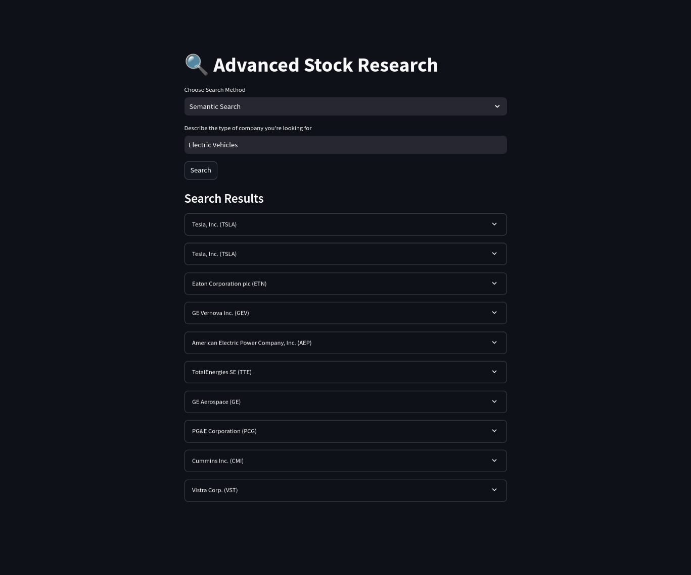
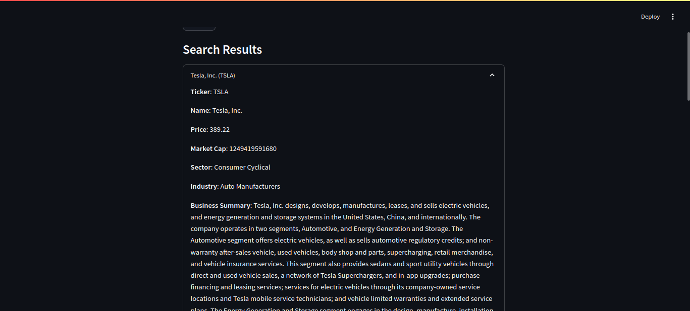
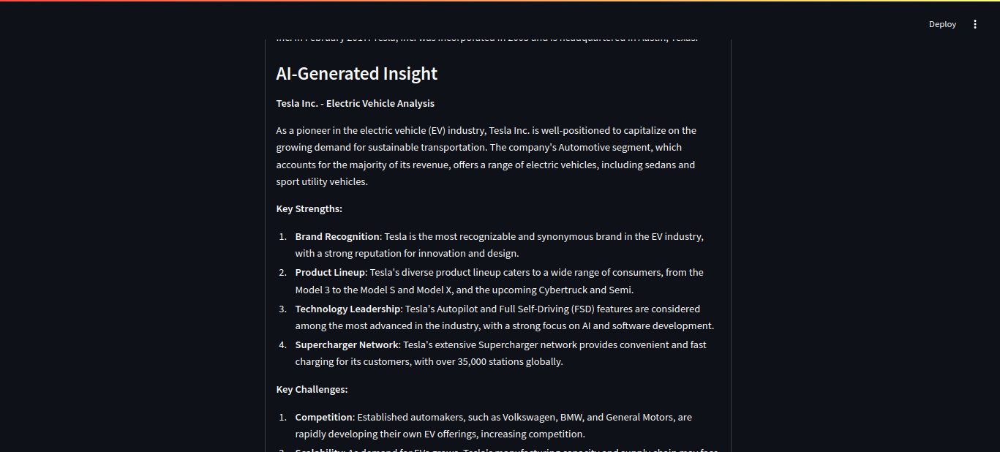

<!-- # Financial Analysis & Automation with LLMs

Leverage large language models (LLMs) to automate financial analysis,perform RAG over a financial dataset, use LLMs to generate financial reports -->

<!-- ## Screenshots -->

# 🔍 Financial Stock Research Automation

## Overview

This Streamlit application provides advanced stock research capabilities through two primary search methods:

### 1. Semantic Search

Find stocks by describing the type of company you're interested in. The application uses advanced natural language processing to match your description with stock descriptions.

### 2. Metric Search

Filter stocks based on quantitative metrics like:

- Market Capitalization
- Trading Volume
- Sector

## Screenshots

## Setup Instructions

1. Clone the repository
2. Install requirements: `pip install -r requirements.txt`
3. Create a `.env`, set up Groq and Pinecone API keys.
4. Run the application: `streamlit run app.py`

## Technologies Used

- Streamlit
- Pinecone Vector Database
- Sentence Transformers
- yFinance

## Future Enhancements

- Expand metric search capabilities
- Add more detailed stock analysis
- Implement advanced filtering options
